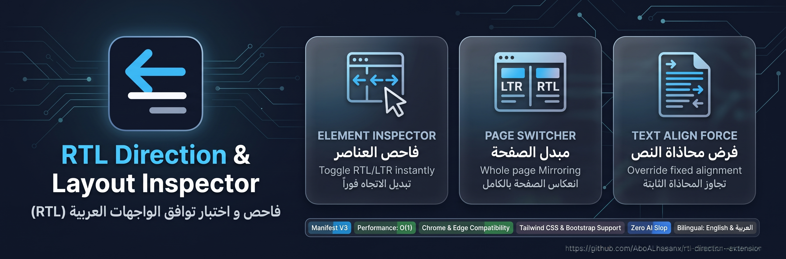

<p align="center">
  <a href="README.md">English</a> • <strong>العربية</strong>
</p>

<p align="center">
  <strong>فاحص واختبار توافق الواجهات العربية (RTL) — إضافة احترافية لفحص وتعديل اتجاه العناصر</strong>
</p>

<p align="center">
  
  
  
  
  
</p>

---

إضافة خفيفة ومطورة للمبرمجين ومصممي الواجهات (Manifest V3) لمتصفحات Chrome و Edge، مخصصة لاختبار توافق أي موقع مع الاتجاه من اليمين إلى اليسار (RTL).

---

## 🎯 المميزات الرئيسية

- **فاحص العناصر التفاعلي (Interactive Inspector)**: مرر الفأرة فوق أي عنصر لرؤية الوسم والفئات (`tag.class`)، واضغط بضغطة واحدة لتبديل اتجاهه فوراً بين RTL و LTR.
- **تبديل اتجاه الصفحة بالكامل (Page Switcher)**: زر للتبديل الفوري بين `الوضع العادي LTR` و `محاذاة لليمين RTL` لكامل عناصر `<html>` و `<body>`.
- **الوضع المزدوج (Dual Mode Support)**: يطبق كلاً من خاصية CSS `style.direction = "rtl"` وسمة HTML `dir="rtl"` لضمان التوافق الكامل مع **Tailwind CSS (`rtl:`)** و **Bootstrap 5 RTL** وإطارات العمل الحديثة.
- **إجبار محاذاة النص (Force Text Align)**: خيار إضافي لتجاوز التنسيقات المحددة مسبقاً بـ `text-align: left`.
- **شريط تنبيه علوي (In-Page HUD Banner)**: شريط غير مزعج يظهر أعلى الصفحة أثناء وضع الفحص لتوضيح الحالة واختصارات لوحة المفاتيح.
- **واجهة ثنائية اللغة**: إمكانية التبديل بنقرة واحدة بين **العربية** و **الإنجليزية** مع انعكاس كامل للواجهة.
- **أداء فائق وبدون تسريب ذاكرة**: تنظيف مباشر بدون فحص كامل للـ DOM مع استهلاك يقارب 0% من المعالج.
- **تصميم نظيف وعصري**: أيقونات متجهية SVG نقية بدون استهلاك موارد وبدون أي مكتبات خارجية.

---

## 🚀 طريقة التثبيت

1. استنسخ أو حمل المستودع:
   ```bash
   git clone https://github.com/AboALhasanx/rtl-direction-extension.git
   ```
2. افتح المتصفح (Chrome أو Edge أو Brave) وتوجه إلى:
   - `chrome://extensions/` أو `edge://extensions/`
3. قم بتفعيل **وضع المطور (Developer mode)** في الزاوية العلوية.
4. اضغط على **تحميل إضافة تم فك حزمتها (Load unpacked)** واختر مجلد الإضافة.

---

## ⌨️ الاستخدام والاختصارات

- **فحص العناصر**: افتح نافذة الإضافة واضغط على **فحص عنصر (Inspect Element)**، ثم اضغط على أي عنصر داخل الصفحة لتبديل اتجاهه.
- **الخروج من وضع الفحص**: اضغط على زر <kbd>Esc</kbd> على لوحة المفاتيح أو زر **إنهاء (Done)** في الشريط العلوي.
- **إعادة تعيين الكل**: اضغط على **إعادة تعيين الكل (Reset All)** لإلغاء جميع التعديلات دفعة واحدة دون الحاجة لتحديث الصفحة.

---

## 📄 الترخيص

هذا المشروع مرخص تحت رخصة [MIT](LICENSE).
